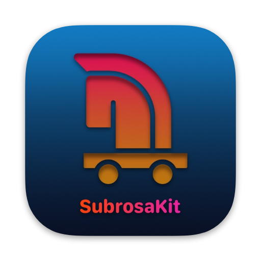
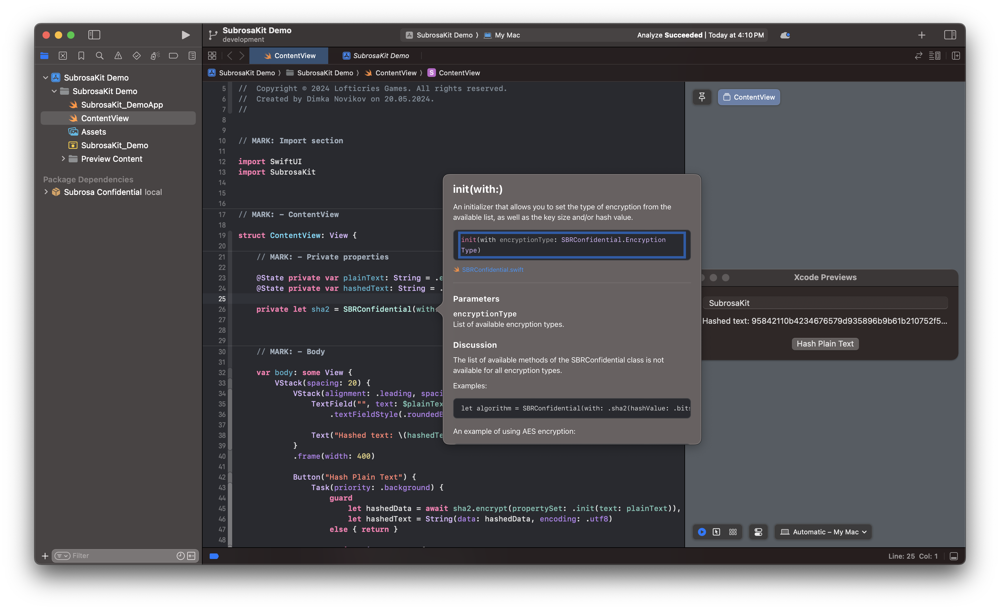
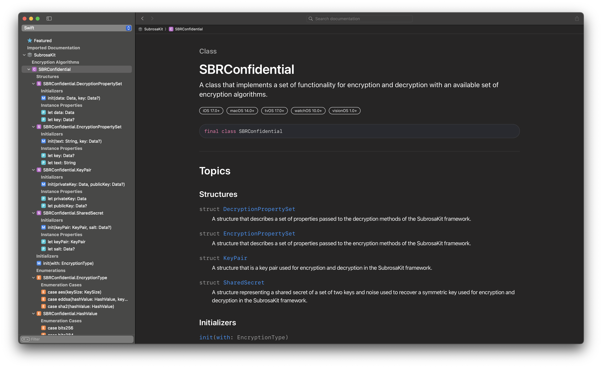

<div align="center"></div>

<br>

<div align="center">
    <a href="https://github.com/apple/swift"></a>
    <a href="https://apps.apple.com/ru/app/xcode/id497799835?l=en&mt=12"></a>
    <a></a>
</div>

<br>

<div align="center">
    <a href="https://git.io/typing-svg"></a>
</div>

### Current Release:
**Status:** `Stable`  
**Version:** `1.0.0`  
**Build:** `11`

#### SubrosaKit is an [Swift Package](#full-description) written in [Swift 5](https://github.com/apple/swift) and designed for ease of use in projects.

An open source cryptographic framework that implements several industry standards algorithms.  
The framework is called SubrosaKit and comes through Swift Package Manager called Subrosa Confidential.

#### `Xcode 15.3+` ﹒ `Swift 5.10+`
#### `iOS 17.0+` ﹒ `macOS Sonoma 14.0+` ﹒ `tvOS 17.0+` ﹒ `visionOS 1.0+` ﹒ `watchOS 10.0+`

- - -

## Table of Contents

* **About the framework**
    * [Full description](#full-description)
    * [Used technologies](#used-technologies)
* **How to add a dependency?**
    * [Swift Package Manager](#swift-package-manager)
* **Documentation Catalog**
    * [Documentation](#documentation)
* **Features Set**
    * [SDK Specification](#sdk-specification)
    * [Encryption Algorithms](#encryption-algorithms)
* **Availability**
    * [Supported OS](#supported-os)
        * [iOS](#ios)
        * [macOS](#macos)
        * [tvOS](#tvos)
        * [visionOS](#visionos)
        * [watchOS](#watchos)
* **Other**
    * [Project e-mail](#project-e-mail)
* **License**
    * [SubrosaKit license](#subrosakit-license)

- - -

### About the framework

#### Full description

###### `Swift Package`

**Name:** `SubrosaKit`  

**Environment:**  `Xcode IDE | Xcode CLT`  

**Target Platform:**  `🍏 Platforms`  

#### Used technologies

`Foundation | CryptoKit` 

- - -

### How to add a dependency?

###### *The patch version varies depending on the releases with bug fixes and errors.*

The framework follows [Semantic Versioning](https://semver.org).

#### Swift Package Manager

You can install the framework using SPM by simply specifying a stable version of the release at the time of download.

- - -

### Documentation Catalog

#### Documentation

Xcode documentation in .docarchive format is also supplied together in the framework.

<div align="center">
    
    
</div>

- - -

### Features Set

#### SDK Specification

To get information about the version and build of the framework, use:

```swift
let version = SBRKit.info.version
print(version)

let build = SBRKit.info.build
print(build)
```

#### Encryption Algorithms

The framework includes a set of four main encryption algorithms that may be required when solving everyday problems. You can get more information in the documentation.

- - -

### Availability

#### Supported OS
###### iOS
`iOS 17.0`﹒`and higher`
###### macOS
`macOS Sonoma 14.0`﹒`and higher`
###### tvOS
`tvOS 17.0`﹒`and higher`
###### visionOS
`visionOS 1.0`﹒`and higher`
###### watchOS
`watchOS 10.0`﹒`and higher`

- - -

### Other

#### Project e-mail
[ddec.team@gmail.com](mailto:ddec.team@gmail.com)

- - -

### License

#### SubrosaKit license

##### `⚠️: SubrosaKit ﹒ Lofticries Games® · 2024`

