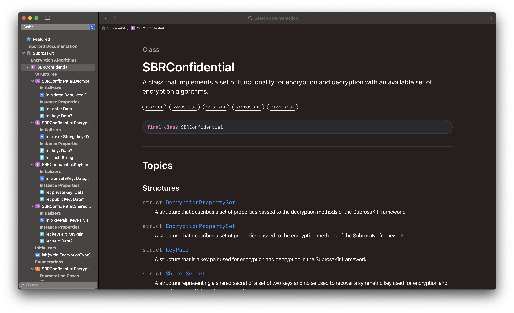

<div align="center"></div>

<br>

<div align="center">
    <a href="https://github.com/apple/swift"></a>
    <a href="https://apps.apple.com/ru/app/xcode/id497799835?l=en&mt=12"></a>
    <a></a>
</div>

<br>

<div align="center">
    <a href="https://git.io/typing-svg"></a>
</div>

### Current Release:
**Status:** `Unstable`  
**Version:** `0.1.0`  
**Build:** `11`

#### SubrosaKit is an [Swift Package](#full-description) written in [Swift 5](https://github.com/apple/swift) and designed for ease of use in projects.

An open source cryptographic framework that implements several industry standards algorithms.  
The framework is called SubrosaKit and comes through Swift Package Manager called Subrosa Confidential.

#### `Xcode 15.3+` ﹒ `Swift 5.10+`
#### `iOS 17.0+` ﹒ `macOS Sonoma 14.0+` ﹒ `tvOS 17.0+` ﹒ `visionOS 1.0+` ﹒ `watchOS 10.0+`

- - -

## Table of Contents

* **About the framework**
* [Full description](#full-description)
* [Used technologies](#used-technologies)
* **How to add a dependency?**
* [Swift Package Manager](#swift-package-manager)
* **Documentation Catalog**
* [Documentation](#documentation)
* **Features Set**
* [SDK Specification](#sdk-specification)
* [Encryption Algorithms](#encryption-algorithms)
* **Availability**
* [Supported OS](#supported-os)
* [iOS](#ios)
* [iPadOS](#ipados)
* [macOS](#macos)
* **Other**
* [Project e-mail](#project-e-mail)
* **License**
* [SubrosaKit license](#subrosakit-license)

- - -

### About the framework

#### Full description

###### `Xcode Fat Framework`

**Name:** `SubrosaKit`  

**Environment:**  `Xcode IDE | Xcode CLT`  

**Target Platform:**  `🍏 Platforms`  

**Binary format:** `The framework comes as a binary file, which simplifies the assembly of projects in which it is used, as well as provides support for the necessary set of architectures, both for real devices and for simulators for the Apple and Intel platform`  

**What is it created for?** `First of all, the framework is designed for use in the game engine, as well as for solving everyday problems in the field of cryptography when developing iOS applications that any iOS developer faces when developing a new project. The framework provides a set of features that simplify and speed up the development of new products based on it`

#### Used technologies

`Foundation | Metal API | Modern Swift Concurrency` 

- - -

### How to add a dependency?

###### *The patch version varies depending on the releases with bug fixes and errors.*

The framework follows [Semantic Versioning](https://semver.org).

#### Swift Package Manager

You can install the framework using SPM by simply specifying a stable version of the release at the time of download.

#### Another way

You can also add a framework to the project by uploading the project from the github, transferring SubrosaKit.xcframework to the sidebar of the Xcode project.

- - -

### Documentation Catalog

#### Documentation

Xcode documentation in .docarchive format is also supplied together in the framework.

<p align="center"> 
  
</p>

<p align="center"> 
  
</p>

- - -

### Features Set

#### SDK Specification

To get information about the version and build of the framework, use:

```swift
let version = SBRKit.info.version
print(version)

let build = SBRKit.info.build
print(build)
```

#### Encryption Algorithms

The framework includes a set of four main encryption algorithms that may be required when solving everyday problems. You can get more information in the documentation.


- - -

### Availability

#### Supported OS
###### iOS
`iOS 17.0`﹒`and higher`
###### iPadOS
`iPadOS 17.0`﹒`and higher`
###### macOS
`macOS Sonoma 14.0`﹒`and higher`
###### macOS
###### macOS

- - -

### Other

#### Project e-mail
[ddec.team@gmail.com](mailto:ddec.team@gmail.com)

- - -

### License

#### SubrosaKit license

##### `⚠️: SubrosaKit ﹒ Lofticries Games® · 2024`

